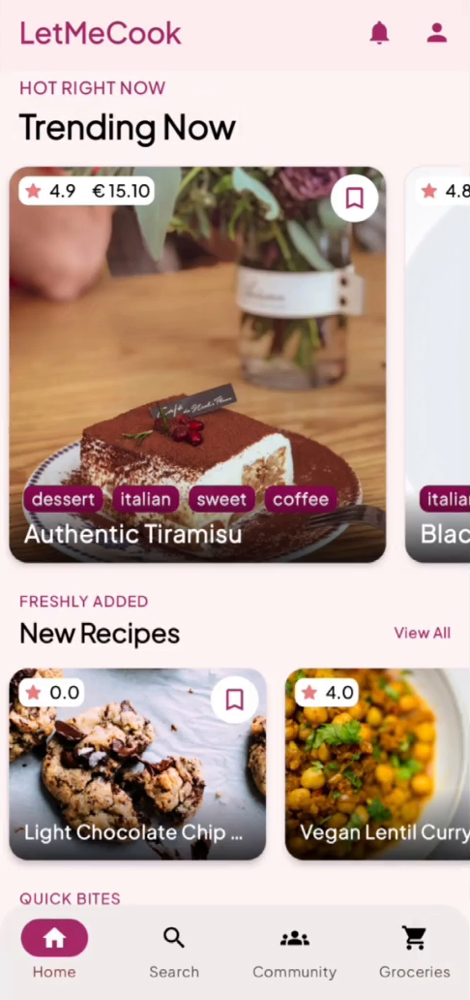
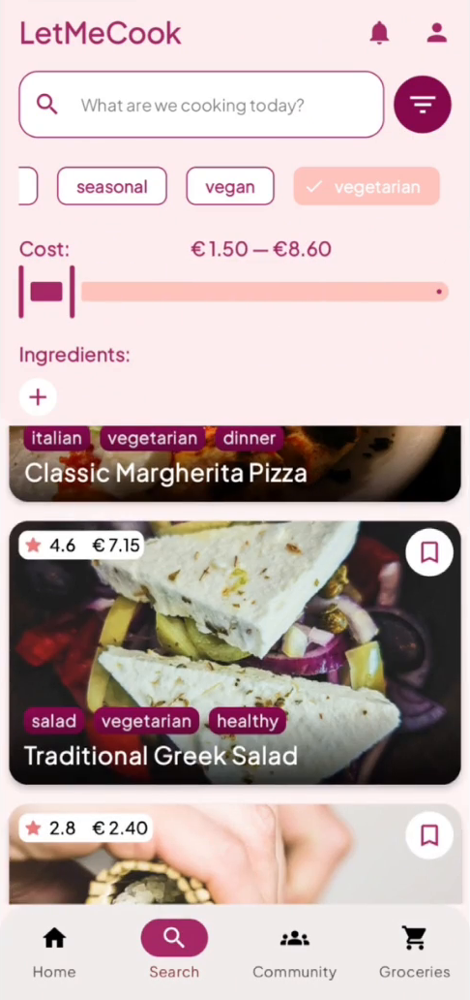
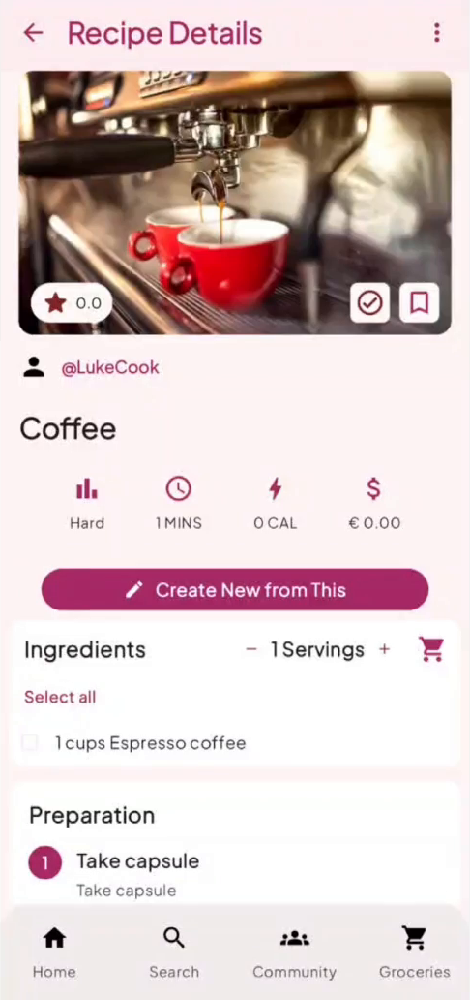
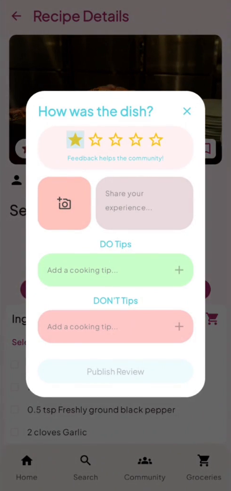
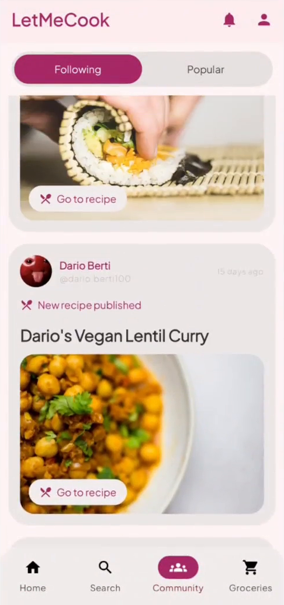
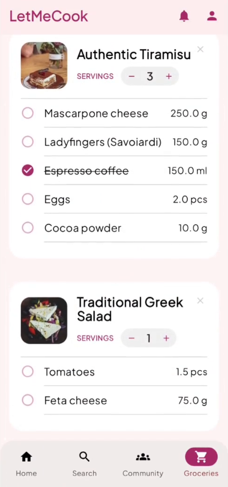
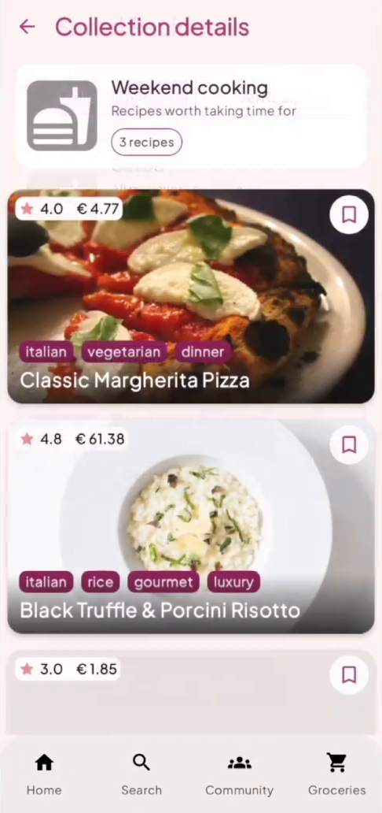
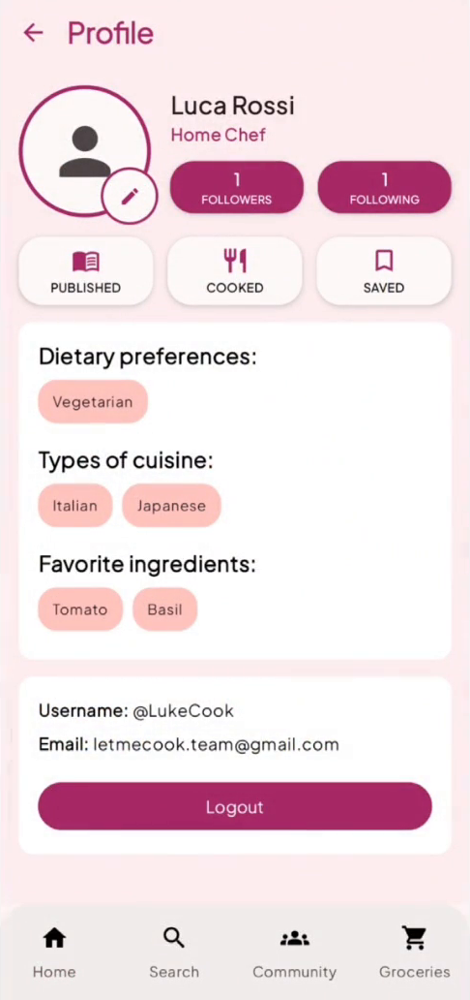

<div align="center">

# 🍳 LetMeCook

### *Your next meal, simplified.*

A recipe-sharing Android app to discover, create and share culinary ideas —
save your favorites, build grocery lists, and cook together with the community.


</div>

---

## 📖 About

**LetMeCook** helps food lovers of every level — from university students cooking their first pasta to seasoned home chefs — find recipes that fit their taste, budget and dietary needs. Users can publish their own recipes step by step (photos included), remix existing ones, review dishes they've cooked, and keep an organized grocery list generated straight from recipe ingredients.

The app was developed as a team project for the **Mobile Applications Development** course (2025/26) at **Politecnico di Torino**.

## 📱 Screenshots

<div align="center">

| Home | Search & Filters | Recipe Details | Review a Dish |
|:---:|:---:|:---:|:---:|
|  |  |  |  |

| Community | Groceries | Collections | Profile |
|:---:|:---:|:---:|:---:|
|  |  |  |  |

</div>

🎥 Want to see it in action? Check out the [demo video](Letmecook%20Demonstration%20%28compresso%29.mp4).

## ✨ Features

- **Discover recipes** — trending dishes, freshly added recipes and quick bites, all from the home feed
- **Smart search** — filter by cost range, ingredients, tags and type of cuisine; your dietary preferences (e.g. *vegetarian*) are applied automatically
- **Recipe pages** — difficulty, prep time, calories and estimated cost per serving, with step-by-step photo instructions
- **Create & remix** — publish your own recipes or *"Create New from This"* to extend someone else's dish
- **Reviews & tips** — mark a recipe as cooked, rate it, share photos and leave DO/DON'T cooking tips
- **Collections** — save recipes into personal collections like *Weekend cooking* or *Lunch ideas*
- **Grocery list** — add ingredients from any recipe (scaled by servings), then check items off while shopping
- **Community** — follow other cooks and see what they publish and cook, or browse what's popular
- **Authentication** — sign in with Google, or browse as a guest with read-only access

## 🛠️ Tech Stack

| Layer | Technology |
|---|---|
| Language | [Kotlin](https://kotlinlang.org/) |
| UI | [Jetpack Compose](https://developer.android.com/compose) + [Material 3](https://m3.material.io/) |
| Architecture | MVVM (ViewModel + Repository pattern) |
| Navigation | Navigation Compose |
| Backend | [Firebase](https://firebase.google.com/) — Firestore, Authentication, Cloud Storage |
| Sign-in | Google Identity / Credential Manager |
| Images | [Coil](https://coil-kt.github.io/coil/) |
| Camera | CameraX (recipe & review photos) |
| Local storage | PaperDB |

## 🚀 Getting Started

### Prerequisites

- [Android Studio](https://developer.android.com/studio) (latest stable)
- JDK 11+
- An Android device or emulator running **Android 12 (API 31)** or higher

### Run from source

```bash
git clone <this-repo-url>
```

1. Open the `app/` folder in Android Studio
2. Let Gradle sync (the Firebase configuration `google-services.json` is already included)
3. Hit **Run** ▶️

### Or just install the APK

A prebuilt release is available at the repo root: [`app-release.apk`](app-release.apk)

## 📂 Repository Structure

```
LetMeCook/
├── app/                     # Android Studio project (Kotlin + Compose)
│   └── app/src/main/
│       ├── java/…/          # auth, domain, model, navigation, repository, ui, viewModel
│       └── assets/          # seed data (recipes, users, reviews, collections)
├── screenshots/             # App screenshots used in this README
├── app-release.apk          # Prebuilt installable APK
├── Presentation.pdf         # Project presentation slides
├── chatbot_interactions.pdf # Documented AI-assistant interactions
└── Letmecook Demonstration (compresso).mp4   # Full app demo video
```

## 👥 Team

| |
|---|
| **Dario Berti** |
| **Savio Casano** |
| **Riccardo Dattena** |
| **Damiano Fusilli** |

<div align="center">

---

Made with ❤️ (and a pinch of salt) at Politecnico di Torino — MAD 2025/26

</div>
